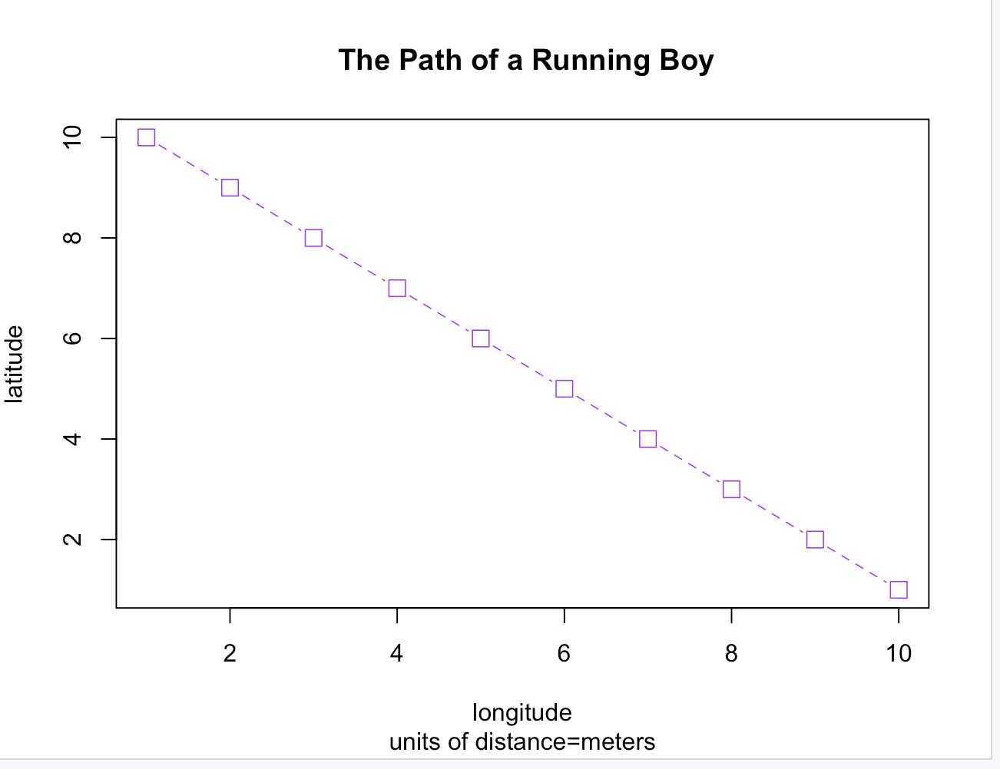
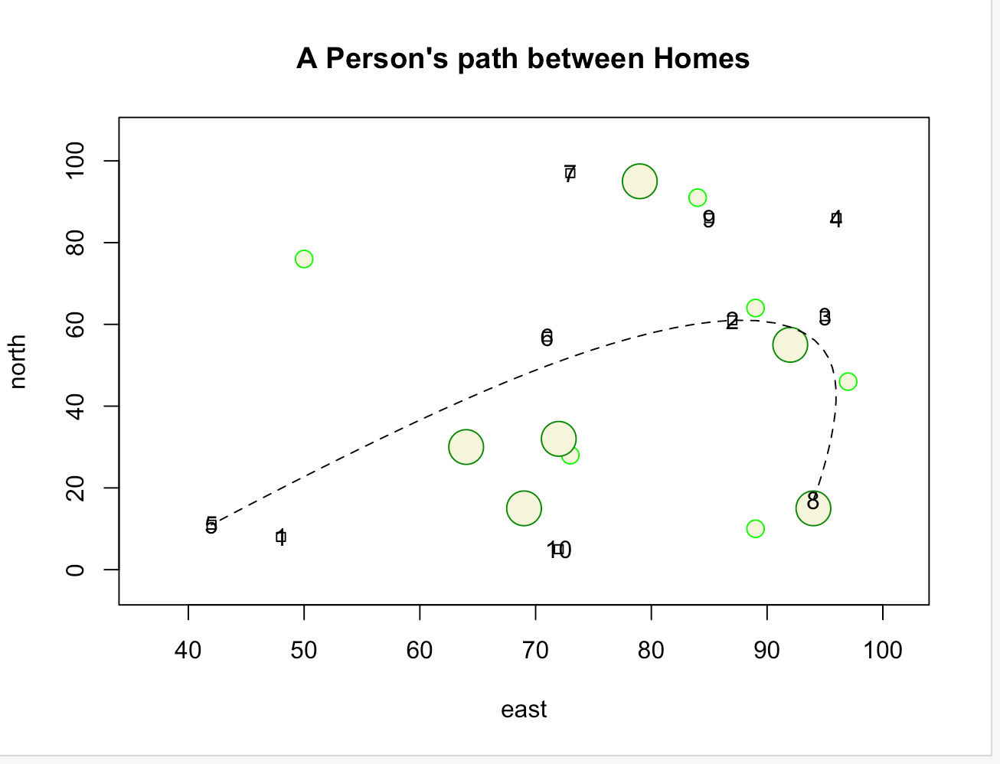

# Abigail Granrud Wicked Problems Exercises
This repository is filled with the first exercises I have completed for the DATA 100 Wicked Problems class.

About Me: I am a freshman at William and Mary interested in studying Neuroscience on the pre-medicine track. I am considering minoring in Public Health and Data Science, so I took this class to learn more about the field of Data Science and how to work with computers. I enjoy learning about chemistry, biology, psychology, and have recently found coding very interesting. With a complete lack of knowlegde when it comes to computers, I have found myself growing as a learner through these exercises. 
# Exercise 1.1 Running Boy

# Exercise 1.2 Person's Path 

