# Abigail Granrud Wicked Problems Exercises
This repository is filled with the first exercises I have completed for the DATA 100 Wicked Problems class.

About Me: I am a freshman at William and Mary interested in studying Neuroscience on the pre-medicine track. I am considering minoring in Public Health and Data Science, so I took this class to learn more about the field of Data Science and how to work with computers. I enjoy learning about chemistry, biology, psychology, and have recently found coding very interesting. With a complete lack of knowlegde when it comes to computers, I have found myself growing as a learner through these exercises. 
# Exercise 1.1 Running Boy

This plot shows a linear path of movement. The plot contains values of x and y up to 10, and plots the values in a continuous sample using a purple dotted line. This is the first plot that I made with R and it is very simple. 
# Exercise 1.2 Person's Path 
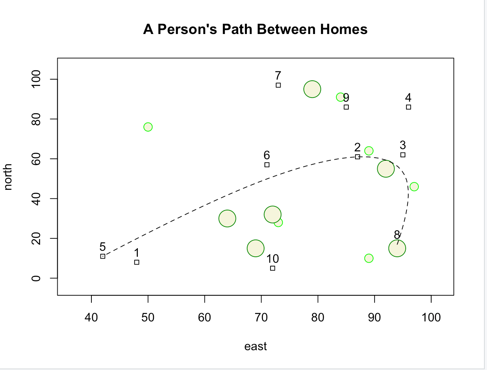
This is a more challenging plot. The plot contains x and y values up to 100, and shows different shapes to represent homes, small trees, and large trees. A spline is used to show the path of someone traveling to three randomly selected houses in the plot. 
# Challenge Question 1 Traveling Salesman
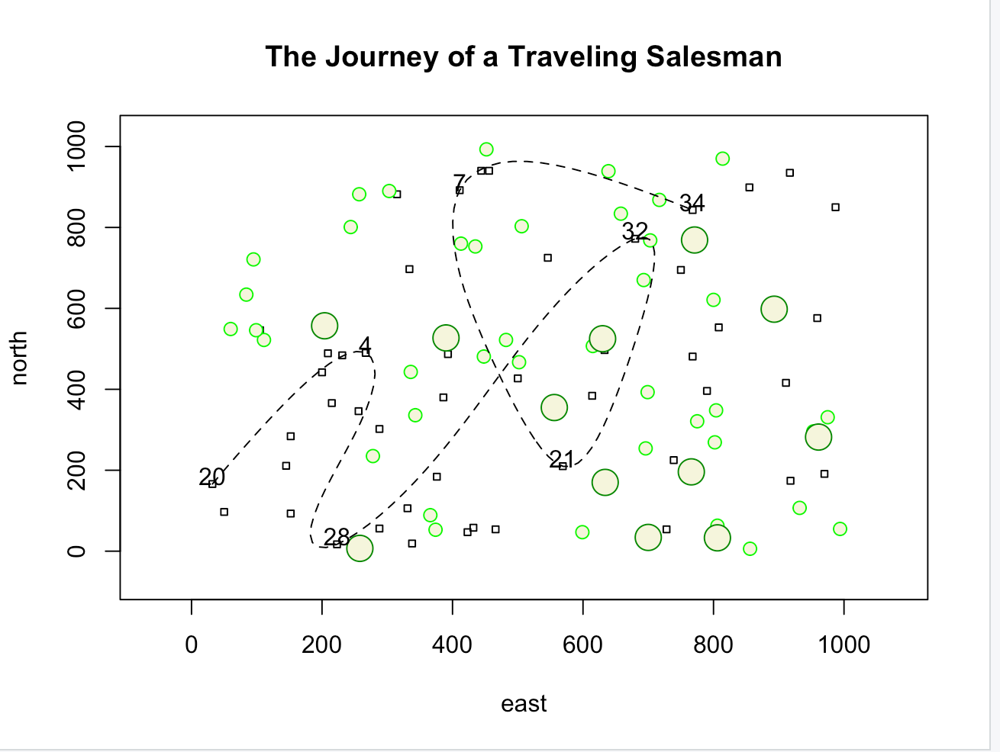
This is the most challenging plot I have created with R. This plot contains values of x and y up to 1000, and contains 50 houses, 40 small trees, and 12 large trees. A dashed spline shows the path of a traveling salesman between 7 randomly selected houses. 
# Project 1
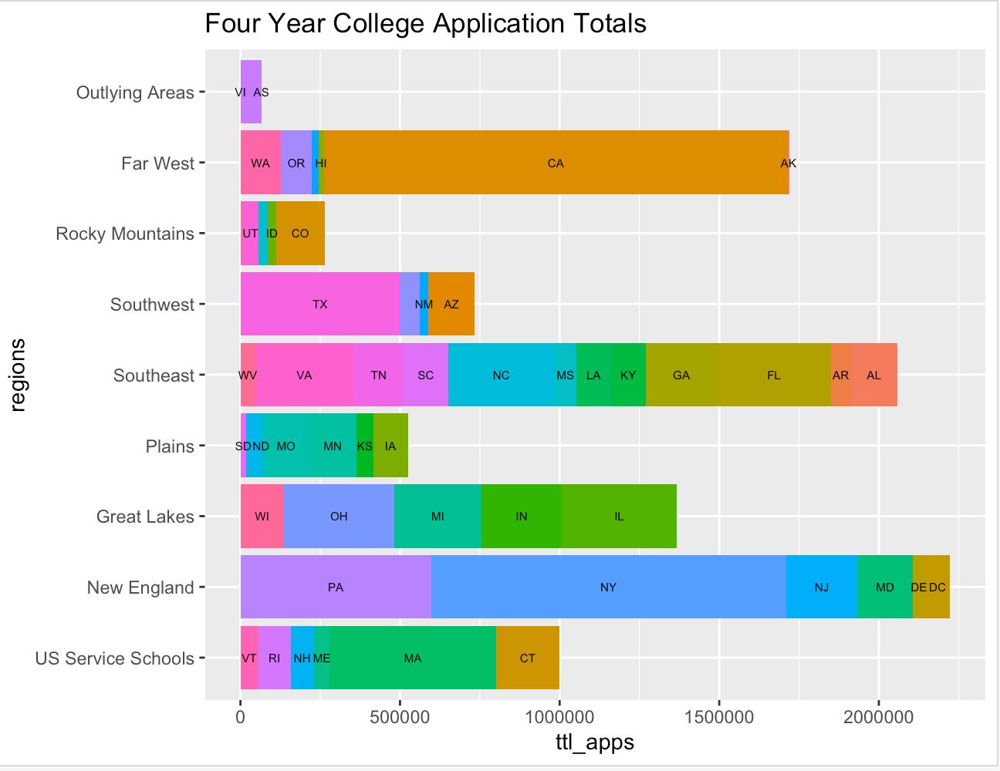
This graph shows the total applications recieved by each institution in the US that offers a minumum of a four year degree, categorized by region and state. 
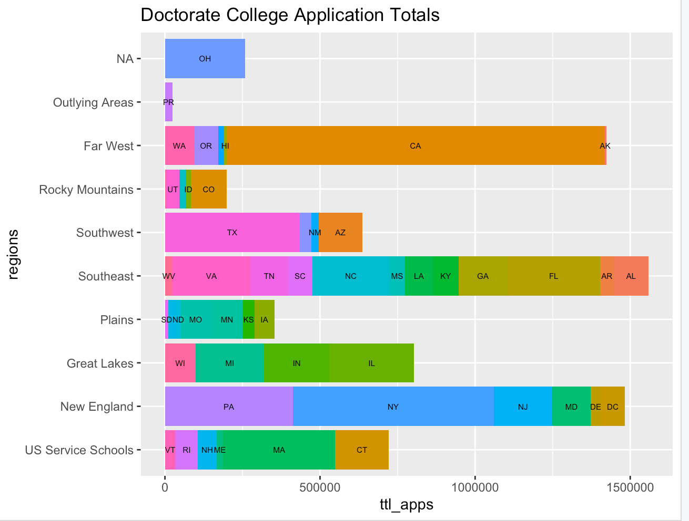
This graph shows the total applications recieved by each institution in the US that offers a minumum of a doctorate degree, categorized by region and state.
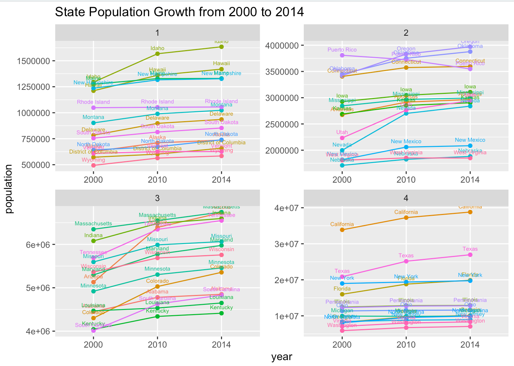
This graph shows the growth of each of the 52 Primary US Subdivisions using census data from 2000 to 2014. 
# Project 2
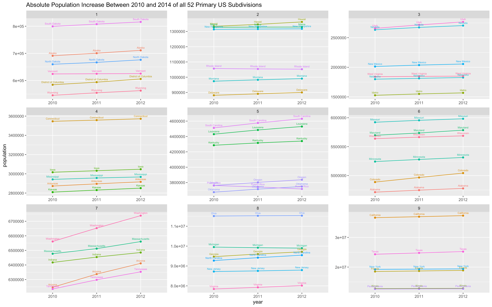
This graph shows the abosolute population increase between 2010 and 2014 of all 50 United States, District of Columbia, and Puerto Rico. 
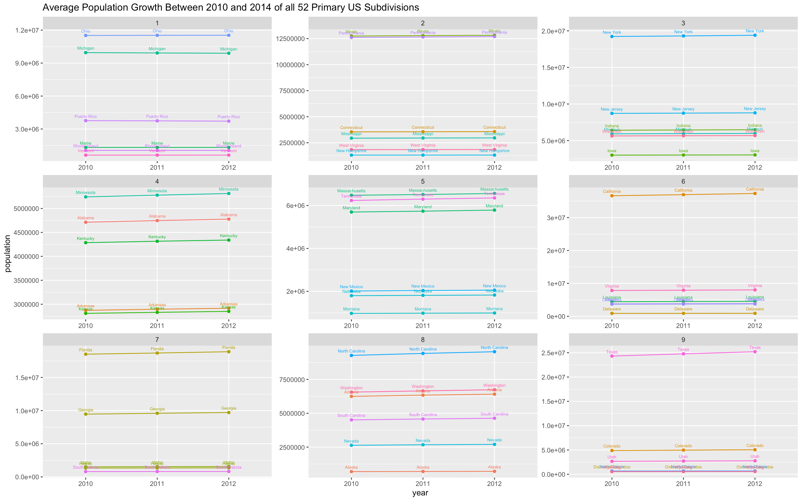
This graph shows the average population growth between 2010 and 2014 of all 50 United States, District of Columbia, and Puerto Rico.  
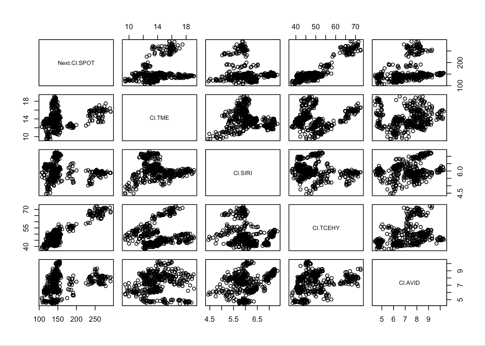
This is a combination of graphs that show the projected values for four music industry stocks based on the previous values of the Spotify(SPOT) stock. The plot predicts the values of Tencent Music Entertainment(TME), Sirius XM(SIRI), Tencent Holdings Limited(TCEHY), and Avid Technology(AVID) based on Spotify's stock price. The trend is loosely positive, with most predicted values increasing when Spotify's values increase. 
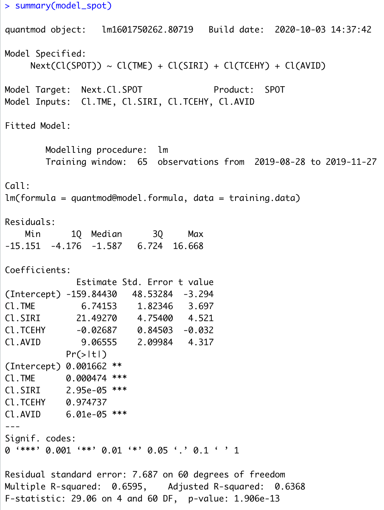
This model shows the numerical data used to create the previous plot. 
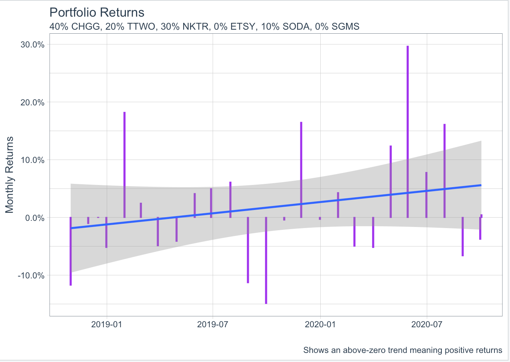
This bar plot shows the returns of investment of $10,000 in a stock portfolio of six stocks. I researched the fastest growing stocks currently, and they included Chegg(CHGG), Take Two Interactive Software(TTWO), Nektar Therapeutics(NKTR), Etsy(ETSY), Sodastream Inc.(SODA), Scientific Games Corporation(SGMS). The investment returns plot shows an above zero trend, meaning that the returns of investment will be positive. 
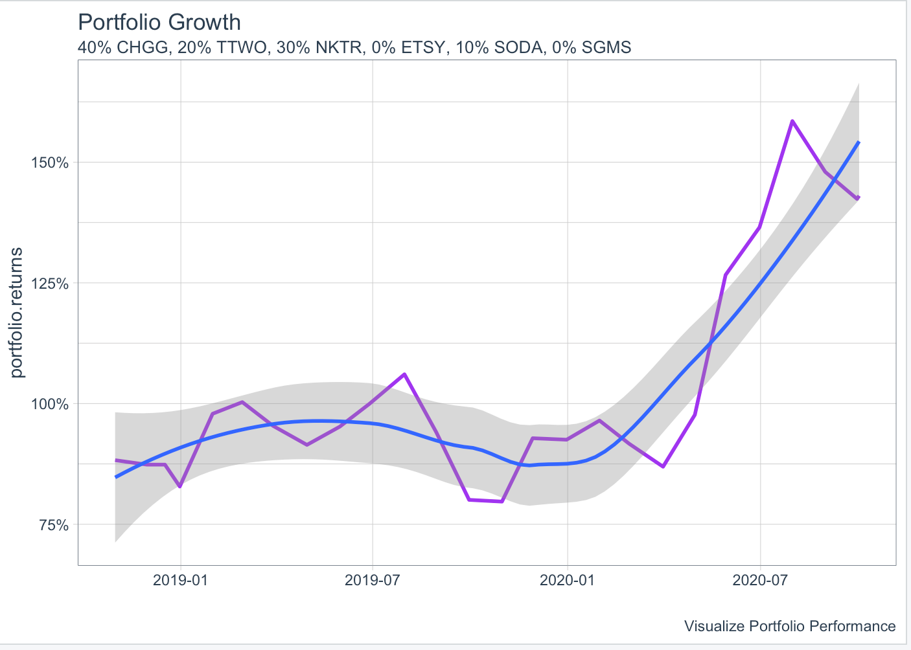
This line graph shows the growth of the $10000 investment portfolio of the previous six stocks. The line shows a great positive trend, meaning that the investment was successful and increased more than 150% during the investment period. 
# Project 3
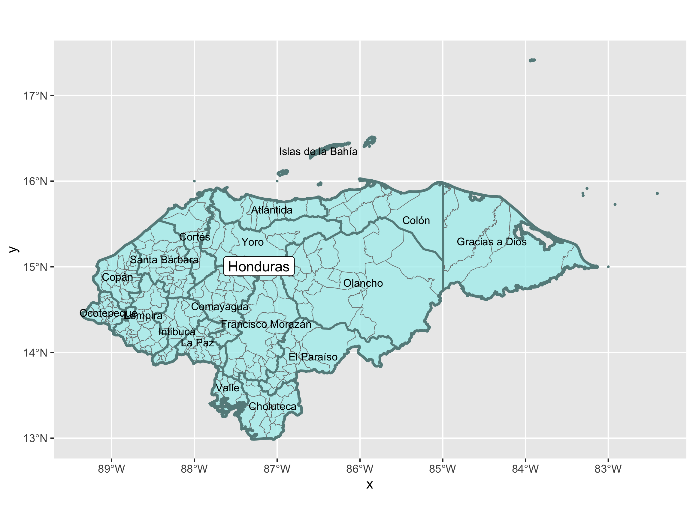
This is a map of Honduras, created using data from GADM. This map shows the international boundary of the country, and two levels of administrative boundaries. Each department, which is similar to a state, is labeled and the boundary is shown in teal, and each county is shown with light grey boundaries. 

This is a map of Honduras' most populous department, Cortés. Each county is labeled. 
# Data Science Reflections
## Reflection 3: Data Science in Breast Cancer Diagnosis
[Link to Reflection 1](https://docs.google.com/document/d/1Tv5lWOSASYQ3et3hxFZEIWSp-7dlirjyPEA17FQsRcY/edit?usp=sharing)
## Reflection 2: Crime Prediction
[Link to Reflection 2](https://docs.google.com/document/d/1eLRuYnOsroqz77QAhOEgFLkgjrjpN_hSVUfe5XhSs9s/edit?usp=sharing)
## Reflection 3: Genetic Mapping With Data Science
[Link to Reflection 3](https://docs.google.com/document/d/1vJmidIM8XwzohHQeAf4T239g5uMqVRO74rTNo_BNp7s/edit?usp=sharing)

